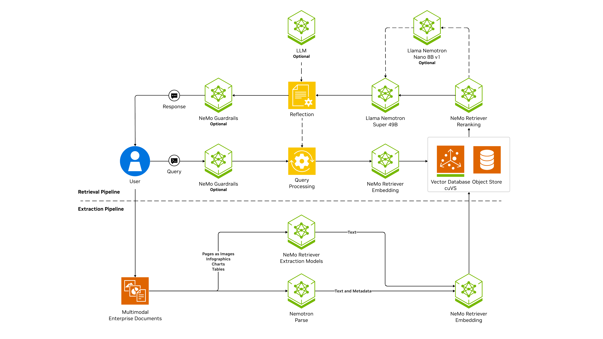

<h1>NVIDIA RAG Blueprint</h1>

Retrieval-Augmented Generation (RAG) combines the reasoning power of large language models (LLMs)
with real-time retrieval from trusted data sources.
It grounds AI responses in enterprise knowledge,
reducing hallucinations and ensuring accuracy, compliance, and freshness.

## Overview

The NVIDIA RAG Blueprint is a reference solution and foundational starting point
for building Retrieval-Augmented Generation (RAG) pipelines with NVIDIA NIM microservices.
It enables enterprises to deliver natural language question answering grounded in their own data,
while meeting governance, latency, and scalability requirements.
Designed to be decomposable and configurable, the blueprint integrates GPU-accelerated components with NeMo Retriever models, Multimodal and Vision Language Models, and guardrailing services,
to provide an enterprise-ready framework.
With a pre-built reference UI, open-source code, and multiple deployment options — including local docker (with and without NVIDIA Hosted endpoints) and Kubernetes —
it serves as a flexible starting point that developers can adapt and extend to their specific needs.

## Key Features

    
Data Ingestion

    <ul>
        <li>Multimodal content extraction - Documents with with text, tables, charts, infographics, and audio. For the full list of supported file types, see [NeMo Retriever Extraction Overview](https://docs.nvidia.com/nemo/retriever/latest/extraction/overview/).</li>
        <li>Custom metadata support</li>
    </ul>

    
Search and Retrieval

    <ul>
        <li>Multi-collection searchability</li>
        <li>Hybrid search with dense and sparse search</li>
        <li>Reranking to further improve accuracy</li>
        <li>GPU-accelerated Index creation and search</li>
        <li>Pluggable vector database</li>
    </ul>

    
Query Processing

    <ul>
        <li>Query decomposition</li>
        <li>Dynamic filter expression creation</li>
    </ul>

    
Generation and Enrichment

    <ul>
        <li>Opt-in for Multimodal and Vision Language Model Support in the answer generation pipeline.</li>
        <li>Document summarization</li>
        <li>Improve accuracy with optional reflection</li>
        <li>Optional programmable guardrails for content safety</li>
    </ul>

    
Evaluation

    <ul>
        <li>Evaluation scripts (RAGAS framework)</li>
    </ul>

    
User Experience

    <ul>
        <li>Sample user interface</li>
        <li>Multi-turn conversations</li>
        <li>Multi-session support</li>
    </ul>

    
Deployment and Operations

    <ul>
        <li>Telemetry and observability</li>
        <li>Decomposable and customizable</li>
        <li>NIM Operator support</li>
        <li>Python library mode support</li>
        <li>OpenAI-compatible APIs</li>
    </ul>

## Software Components

The RAG blueprint is built from the following complementary categories of software:

- **NVIDIA NIM microservices** – Deliver the core AI functionality. Large-scale inference (e.g.for example, Nemotron LLM models for response generation), retrieval and reranking models, and specialized extractors for text, tables, charts, and graphics. Optional NIMs extend these capabilities with OCR, content safety, topic control, and multimodal embeddings.

- **The integration and orchestration layer** – Acts as the glue that binds the system into a complete solution.

This modular design ensures efficient query processing, accurate retrieval of information, and easy customization.

### NVIDIA NIM Microservices

- Response Generation (Inference)

    - [NVIDIA NIM llama-3.3-nemotron-super-49b-v1.5](https://build.nvidia.com/nvidia/llama-3_3-nemotron-super-49b-v1_5)

- Retriever and Extraction Models

    - [NVIDIA NIM llama-3_2-nv-embedqa-1b-v2]( https://build.nvidia.com/nvidia/llama-3_2-nv-embedqa-1b-v2)
    - [NVIDIA NIM llama-3_2-nv-rerankqa-1b-v2](https://build.nvidia.com/nvidia/llama-3_2-nv-rerankqa-1b-v2)
    - [NeMo Retriever Page Elements NIM](https://build.nvidia.com/nvidia/nemoretriever-page-elements-v2)
    - [NeMo Retriever Table Structure NIM](https://build.nvidia.com/nvidia/nemoretriever-table-structure-v1)
    - [NeMo Retriever Graphic Elements NIM](https://build.nvidia.com/nvidia/nemoretriever-graphic-elements-v1)
    - [PaddleOCR NIM](https://build.nvidia.com/baidu/paddleocr)

- Optional NIMs

    - [Llama 3.1 NemoGuard 8B Content Safety NIM](https://build.nvidia.com/nvidia/llama-3_1-nemoguard-8b-content-safety)
    - [Llama 3.1 NemoGuard 8B Topic Control NIM](https://build.nvidia.com/nvidia/llama-3_1-nemoguard-8b-topic-control)
    - [Llama-3.1 Nemotron-nano-vl-8b-v1 NIM](https://build.nvidia.com/nvidia/llama-3.1-nemotron-nano-vl-8b-v1)
    - [NeMo Retriever Parse NIM](https://build.nvidia.com/nvidia/nemoretriever-parse)
    - [NeMo Retriever OCR NIM](https://build.nvidia.com/nvidia/nemoretriever-ocr) (Early Access)
    - [llama-3.2-nemoretriever-1b-vlm-embed-v1](https://build.nvidia.com/nvidia/llama-3_2-nemoretriever-1b-vlm-embed-v1) (Early Access)

 ### Integration and orchestration layer

- **RAG Orchestrator Server** – Coordinates interactions between the user, retrievers, vector database, and inference models, ensuring multi-turn and context-aware query handling. This is [LangChain](https://www.langchain.com/)-based.

- **Vector Database (accelerated with NVIDIA cuVS)** – Stores and searches embeddings at scale with GPU-accelerated indexing and retrieval for low-latency performance. You can use [Milvus Vector Database](https://milvus.io/) or [Elasticsearch](https://www.elastic.co/elasticsearch/vector-database).

- **NeMo Retriever Extraction** – A high-performance ingestion microservice for parsing multimodal content. For more information about the ingestion pipeline, see [NeMo Retriever Extraction Overview](https://docs.nvidia.com/nemo/retriever/latest/extraction/overview/)

- **RAG User Interface (rag-frontend)** – A lightweight user interface that demonstrates end-to-end query, retrieval, and response workflows for developers and end users. For more information, refer to [RAG UI](docs/user-interface.md).

## Technical Diagram

The following image represents the architecture and workflow.

  

  
  

## Workflow

The following is a step-by-step explanation of the workflow from the end-user perspective:

1. **Data Ingestion & Extraction Pipeline** – Multimodal enterprise documents (text, images, tables, charts, infographics, and audio) are ingested.

2. **User Query** – The user interacts with the system through the UI or APIs, submitting a question. An optional NeMo Guardrails module can filter or reshape the query for safety and compliance before it enters the retrieval pipeline.

3. **Query Processing** – The query is processed by the Query Processing service, which may also leverage reflection (an optional LLM step) to improve query understanding or reformulation for better retrieval results.

4. **Retrieval from Enterprise Data** – The processed query is converted into embeddings using NeMo Retriever Embedding and matched against enterprise data stored in a cuVS accelerated Vector Database (CuVS) and associated object store(minIO). Relevant results are identified based on similarity.

5. **Reranking for Precision** – An optional NeMo Retriever Reranker reorders the retrieved passages, ensuring the most relevant chunks are selected to ground the response.

6. **Response Generation** – The selected context is passed into the LLM inference service (e.g., Llama Nemotron models). An optional reflection step can further validate or refine the answer against the retrieved context. Guardrails may also be applied to enforce safety before delivery.

7. **User Response** – The generated, grounded response is sent back to the user interface, often with citations to retrieved documents for transparency.

## Get Started With NVIDIA RAG Blueprint

The recommended way to get started is to deploy the NVIDIA RAG Blueprint
with Docker Compose for a single node deployment, and using self-hosted on-premises models.
For details, refer to [Get Started](docs/deploy-docker-self-hosted.md).

Refer to the [full documentation](docs/readme.md) to learn about the following:

- Minimum Requirements
- Deployment Options
- Configuration Settings
- Common Customizations
- Available Notebooks
- Troubleshooting
- Additional Resources

## Blog Posts

- [NVIDIA NeMo Retriever Delivers Accurate Multimodal PDF Data Extraction 15x Faster](https://developer.nvidia.com/blog/nvidia-nemo-retriever-delivers-accurate-multimodal-pdf-data-extraction-15x-faster/)
- [Finding the Best Chunking Strategy for Accurate AI Responses](https://developer.nvidia.com/blog/finding-the-best-chunking-strategy-for-accurate-ai-responses/)

## Inviting the community to contribute

We're posting these examples on GitHub to support the NVIDIA LLM community and facilitate feedback.
We invite contributions!
To open a GitHub issue or pull request, see the [contributing guidelines](./CONTRIBUTING.md).

## License

This NVIDIA AI BLUEPRINT is licensed under the [Apache License, Version 2.0.](./LICENSE) This project will download and install additional third-party open source software projects and containers. Review [the license terms of these open source projects](./LICENSE-3rd-party.txt) before use.

Use of the models in this blueprint is governed by the [NVIDIA AI Foundation Models Community License](https://docs.nvidia.com/ai-foundation-models-community-license.pdf).

## Terms of Use
This blueprint is governed by the [NVIDIA Agreements | Enterprise Software | NVIDIA Software License Agreement](https://www.nvidia.com/en-us/agreements/enterprise-software/nvidia-software-license-agreement/) and the [NVIDIA Agreements | Enterprise Software | Product Specific Terms for AI Product](https://www.nvidia.com/en-us/agreements/enterprise-software/product-specific-terms-for-ai-products/). The models are governed by the [NVIDIA Agreements | Enterprise Software | NVIDIA Community Model License](https://www.nvidia.com/en-us/agreements/enterprise-software/nvidia-community-models-license/) and the [NVIDIA RAG dataset](./data/multimodal/) which is governed by the [NVIDIA Asset License Agreement](https://github.com/NVIDIA-AI-Blueprints/rag/blob/main/data/LICENSE.DATA).
The following models that are built with Llama are governed by the Llama 3.2 Community License Agreement: nvidia/llama-3.2-nv-embedqa-1b-v2 and nvidia/llama-3.2-nv-rerankqa-1b-v2 and llama-3.2-nemoretriever-1b-vlm-embed-v1.

## Additional Information

The [Llama 3.1 Community License Agreement](https://www.llama.com/llama3_1/license/) for the llama-3.1-nemotron-nano-vl-8b-v1, llama-3.1-nemoguard-8b-content-safety and llama-3.1-nemoguard-8b-topic-control models. The [Llama 3.2 Community License Agreement](https://www.llama.com/llama3_2/license/) for the nvidia/llama-3.2-nv-embedqa-1b-v2, nvidia/llama-3.2-nv-rerankqa-1b-v2 and llama-3.2-nemoretriever-1b-vlm-embed-v1 models. The [Llama 3.3 Community License Agreement](https://github.com/meta-llama/llama-models/blob/main/models/llama3_3/LICENSE) for the llama-3.3-nemotron-super-49b-v1.5 models. Built with Llama. Apache 2.0 for NVIDIA Ingest and for the nemoretriever-page-elements-v2, nemoretriever-table-structure-v1, nemoretriever-graphic-elements-v1, paddleocr and nemoretriever-ocr-v1 models.

